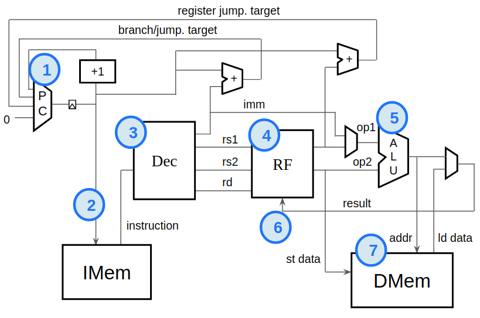
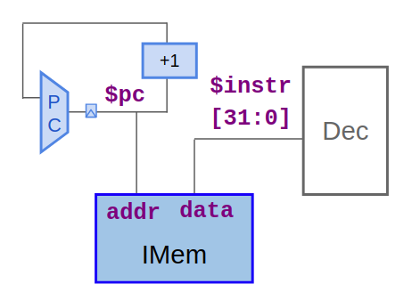
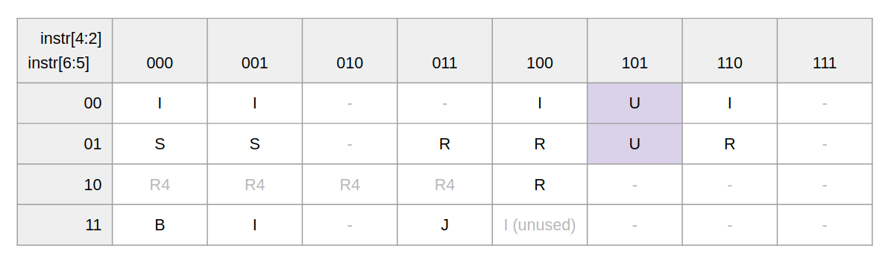
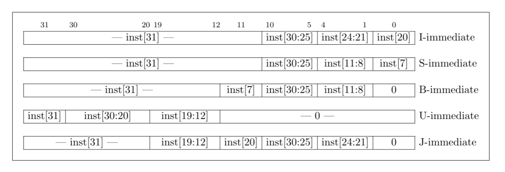
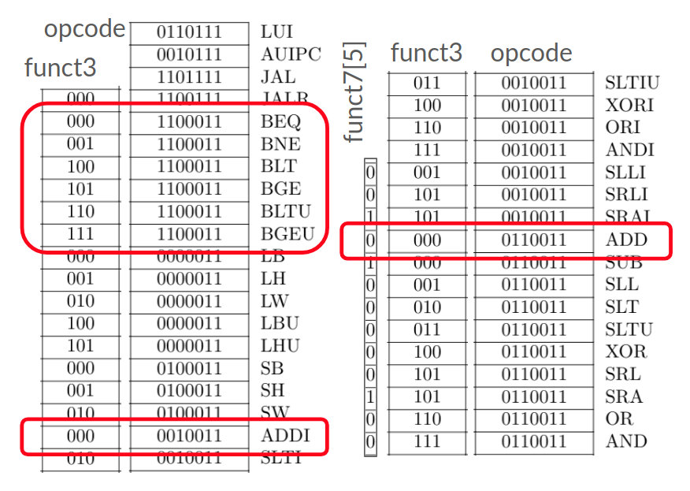
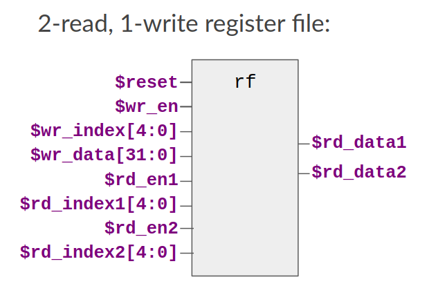

# [Building a RISC-V CPU Core](https://learning.edx.org/course/course-v1:LinuxFoundationX+LFD111x+1T2021/home)
Build a RISC-V CPU core with TL-Verilog

## How to start
### Install makerchip IDE
```bash
pip3 install makerchip-app
```
### Run makerchip IDE
```bash
makerchip riscv.tlv
```

## Implementation plan


<details>
  <summary>1. PC logic</summary>
  
</details>

<details>
  <summary>2. Fetch</summary>
  
</details>

<details>
  <summary>3. Decode logic</summary>
  
  
  
  
</details>

<details>
  <summary>4. Register file read</summary>
  
</details>

5. ALU
6. Register file write
7. DMem
